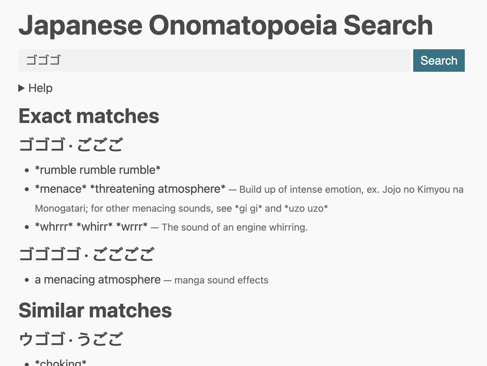

# jp-onomatopoeia

[Japanese Onomatopoeia Search](https://nsk.sh/tools/jp-onomatopoeia/)

Compiled dataset and search tool for Japanese onomatopoeia and sound effects.

## Preview

## Data sources

- [nihongoresources.com](https://github.com/Pomax/nihongoresources.com)
- [Japanese Manga SFX spreadsheet](https://docs.google.com/spreadsheets/d/1iXFIVmSzukN1PYD1JakdqMmrNNlc7TtkutDKevuKM0c/edit)
- [The Jaded Network](http://thejadednetwork.com/sfx/) (included in the Japanese Manga SFX spreadsheet)
